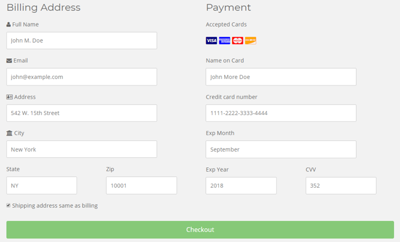

<h1> CatMint </h1>
This project was generated with MEAN (MongoDB v.4x, Express.js v.4.1, Angular8, Node.js v6.0) stack.

<h1> Overview of CatMint </h1>
Catmint cat-sitters (CCS) is a cat service company that started in 2020 in TX. The company currently has one manager, 5 cat sitters, 10 rooms for cats, provides a variety of services to customers to help them look after their cats. CCS currently only serves people in the local town. 

<h1>Main Purpose</h1>
Catmint is now developing a website for customers to make reservations online. Customers can schedule a time and specify the gender of the people who take care of their cat. Two ways are provided to customers, one is they can send cats to our store. Another way is that we can go to their home. We offer three types of services right now, including feeding the cat, walking the cat, and bringing the cat to the hospital. The website will have some special discounts on special holidays. We hope that the customer can trust to leave their loved cats to us and we will do our best to look after them!

<h1>Key functionality</h1>
Currently, operations at CCL are conducted mainly by hand. The customer services will receive a phone call from the customer and record their needs. After that, they will match the cat sitters to customers according to their request. After several interviews and their frequent customer, they decided that the website and mobile phone must have the following function:

<h2>Sign-up/ login</h2>
The customers are able to create a new account when they first log in to the system. When they create the accounts, they need to fill in their username, email, and password. That information will be recorded in the database. After creating the account, customers can see their past appointments on the website and on the mobile phone.

<h2>Personal information and pets record</h2>
When the user login their account, the user could see their usernames, email, and recent services they requested. In the customer account, customers can maintain their cats’ records. The more information they provided, the better the services would be provided. So, customers would fill the types of cats, the gender, the favorite food for their cats, etc. The caring services could be based on this information, which helps the company meet the further requirements of customers. After delivering services, customers have chances to take a review which is very important for CCS to improve service and customer satisfaction. In the feedback webpage, users can type in the rating and verbal review. Then the system collects data into database tables for further analysis. Moreover, users can also update the pet records based on the caring services, so they can get more appropriate services in the next time.

<h2>Make an appointment</h2>
Another function of the database is to record customers’ appointments. Customers could make an appointment and schedule time for cat-sitting through the website. A customer can choose the services they need when making an appointment.
First, customers could choose “accommodation” in an appointment, then customers could send their cats to CCS and pick up their cats in their intended time. Second, if customers need someone to go to their houses to feed the cat, then they could choose the “Feed” service. Customers can also choose that they need CCS to prepare cat food or they have their own cat food. Third, CCS provides service that accompanies cats to the hospital. After customers deliver needed documents to CCS, then CCS will accompany their cats to the designated hospitals. Fourth, for those who may be concerned about strangers walking into their houses to feed cats, customers could choose the gender of the cat sitter when they make an appointment. After customers finish the appointments, that information will be recorded into the CCS database. Fifth, there’s a comment box for customers to fill in anything they think CCS needs to know.
 
 
The database is used to generate a daily report, which lists all customers’ scheduled appointment times and customers’ names. The staff could check the report to deliver services. Also, the database will be linked to customers’ accounts, so customers could check their appointment through their accounts.

<h1>General Guidelines</h1>
<h2>Sign-up and login</h2>
New users could sign up through the sign-up page. They need to input their username, email and password to create a new account. After they created accounts successfully, users will be directed to log in page to login.  

 

<h2>Personal Information</h2>
<h3>Profile</h3>
In the profile page, users could see their usernames, emails, and recent services they requested. 

<h3>Message</h3>
Users could send their messages to us through this page. Also, they could rate our services by the rating below. We could know our customers’ feedback and whether they were satisfied with our services. In the future, we will utilize that information to improve our services or processes. 

<h3>Update/Edit</h3>
Users could add their cats’ names, ages, and breed on this page. By doing so, we could understand our customer’s pets and know how to take care of them more specifically. Especially old cats, we’ll take extra care to old cats no matter with food or the intensity of the exercises.  

<h2>Make an appointment</h2>
This is one of our key functions. Customers could make an appointment on this page. They could specify their date and time. Also, the gender of our servers. As one of our target customers is single women, we want our customers to feel comfortable with our servers going to their houses. Furthermore, customers could choose the way of the services. They want us to go to their houses to serve or send their cats to our store. After that, they could choose services in the shopping cart and see how much they need to pay. Also, they could remind us if there’s anything that we need to know about their pets or rules in the comment section.  

<h2>Checkout</h2>
After customers made appointments, they will be directed to the checkout page. They need to input personal information and card information to checkout.  

<h2>Administration</h2>
When logging in as an administrator, the user could click “Hello admin” to see the database page. The user could delete the data and also view personal information of all users, such as username, email, time, place, and services.  

<h1>Web development</h1>
<h2>Technology Overview</h2>
<h3>The File Structure</h3>
User.js is used for storing user schema for MongoDB. Create, Read, Update, and Delete actions for MongoDB is in api.js. The profile is used for Heroku to run this website. Server.js has the information of connection for MongoDB Cloud  

<h3>Controllers and Webpages</h3>
We put all the js files under controllers. We have js files for the shopping cart, user profile and so on. The mainCtrl.js was the main js file for the whole website. And we put all the HTML files under pages, we put all pages about users under “users”, which includes login, logout, personal profile, and register. Other pages include admin, which is for the administration page, appointment, checkout, home, services, and shopping cart page. By collecting all of the HTML files here, we could know what pages we have and add new pages easier.  

<h3>CSS and images</h3>
We put all of the CSS files together, usually, we name the file the same as the HTML files so that we could know the corresponding HTML files quickly. Also, we put all of the images together under “image” and “img”, which could help us find the images we need more efficiently.  

  
